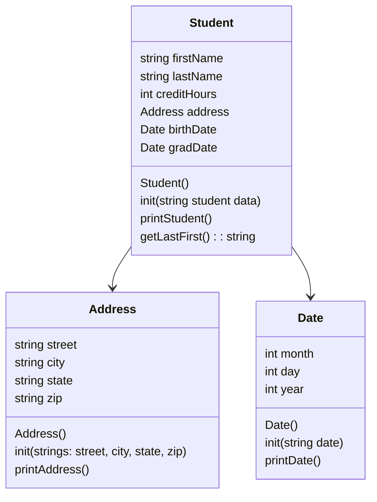

# project7
Heap of Students

## UML Diagram

```mermaid
classDiagram

class Date {
    int month
    int day
    int year
    Date()
    init(string date)
    printDate()
}
class Student {
    string firstName
    string lastName
    int creditHours
    Address address
    Date birthDate
    Date gradDate
    Student()
    init(string student data)
    printStudent()
    getLastFirst() : string
}
class Address {
    string street
    string city
    string state
    string zip
    Address()
    init(strings: street, city, state, zip)
    printAddress()
}

Student --> Address
Student --> Date
```
