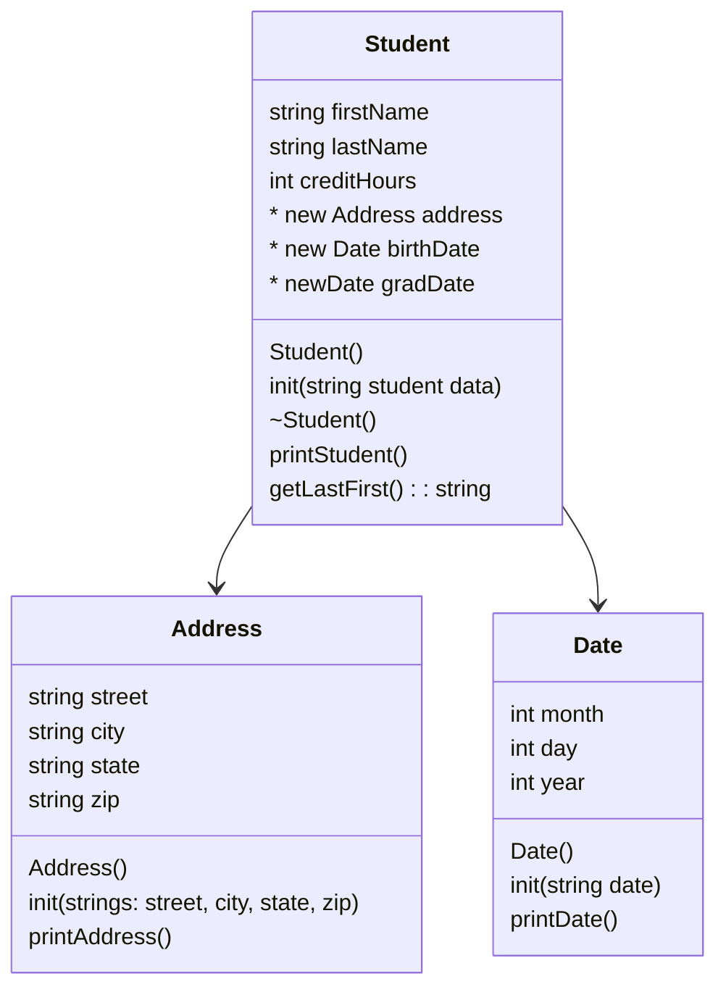

# project7.2
Heap of Students Pt.2

## UML Diagram


## Algorithm
## Main
```
create student vector w/ Student pointers
loadStudents loads vector from file

//menu options
    0 - quit
    1 - print names
    2 - print data
    3 - find student
user input int menuOption

keepGoing

while keepGoing:
    if menuOption == 0
        keepGoing false
    if ~ == 1
        showStudentNames
    if ~ == 2
        printStudents
    if ~ == 3
        findStudent
delStudents
```
## loadStudents
```
input file
line input

each line into line input
    new student; init from line
    add to vector
```
## printStudents
```
cycle throgh students
    call printStudent
```
## showStudentNames
```
cycle through students
    print student name, credit hrs
```
## findStudent
``` 
    ask for last name
    cycle through students
        if found, print student
        if not, print "Student not found"
```
## delStudents
```
loop through students in vector
    delete
```

### Date
-init(addressDate)
```
string month, day, year
stringstream converter
converter addressDate
getLine (converter, month string, '/')
getLine (~, day string, ~)
getLine(~, year string)
converter << month string, day string, year string
converter >> month, day, year
```
-printDate()
```
print month day, year
```
### Student
-init(studentString)
```
string firstName
string lastName
string tempCreditHours
int creditHours
stringstream converter

string tempStreet
string tempCity
string tempState
string tempZip
string tempAddress

string tempbirthDate
string tempgradDate

* Address address
* Date birthDate
* Date gradDate

getLine(converter, firstName, ',')
getLine(~, lastName, ',')
getLine(~, tempStreet, ',')
getLine(~, tempCity, ',')
getLine(~, tempState, ',')
getLine(~, tempZip, ',')
getLine(~, tempbirthDate, ',')
getLine(~, tempgradDate, ',')
getLine(~, tempCreditHours, ',')

tempAddress = tempStreet + ", " + tempCity + ", " + tempState + ", " + tempZip

converter clear & str
converter tempCreditHours --> int creditHours

address = new tempAddress
birthDate = new tempBirthDate
gradDate = new tempGradDate
```
-~Student()
```
delete address
delete birthDate
delete gradDate
```
-printStudent()
```
print first lastname
print address
print "DOB:" + birthDate
print "Grad:" + gradDate
print "Credits:" + creditHours
```
-getLastFirst()
```
print lastname + ',' + firstname
```
### Address
-init(addressString)
```
string street, city, state, zip
getLine (addressString, street string, ',')
getLine (~, city string, ~)
getLine(~, state string, ~)
getLine(~, zip string)
```
-printAddress()
```
print street
print city state, zip
```
