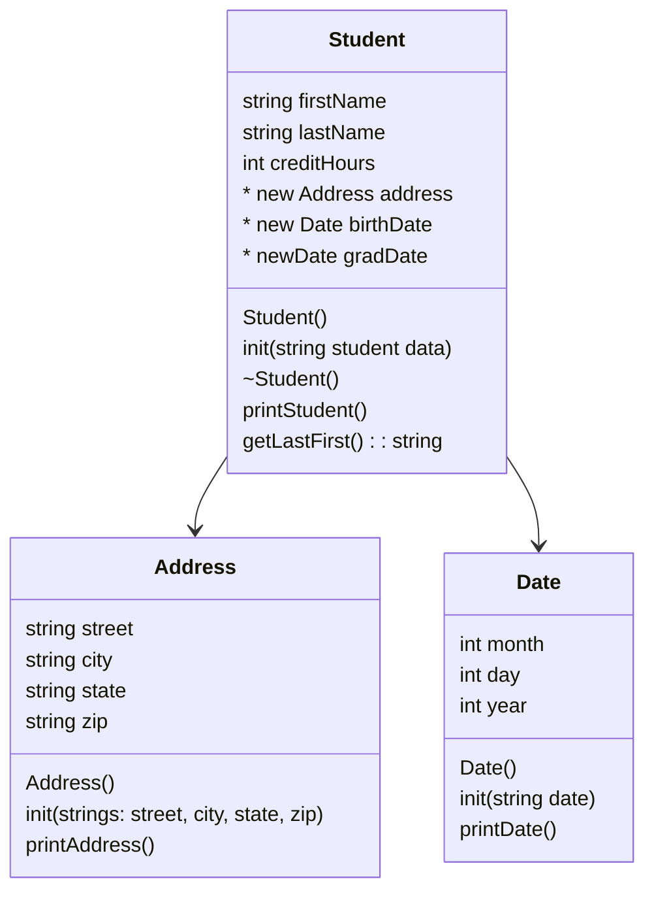

# project7
Heap of Students

## UML Diagram


## Algorithm
### Date
-init(addressDate)
```
string month, day, year
stringstream converter
converter addressDate
getLine (converter, month string, '/')
getLine (~, day string, ~)
getLine(~, year string)
converter << month string, day string, year string
converter >> month, day, year
```
-printDate()
```
print month day, year
```
### Student
-init(studentString)
```
string firstName
string lastName
string tempCreditHours
int creditHours
stringstream converter

string tempStreet
string tempCity
string tempState
string tempZip
string tempAddress

string tempbirthDate
string tempgradDate

* Address address
* Date birthDate
* Date gradDate

getLine(converter, firstName, ',')
getLine(~, lastName, ',')
getLine(~, tempStreet, ',')
getLine(~, tempCity, ',')
getLine(~, tempState, ',')
getLine(~, tempZip, ',')
getLine(~, tempbirthDate, ',')
getLine(~, tempgradDate, ',')
getLine(~, tempCreditHours, ',')

tempAddress = tempStreet + ", " + tempCity + ", " + tempState + ", " + tempZip

converter clear & str
converter tempCreditHours --> int creditHours

address = new tempAddress
birthDate = new tempBirthDate
gradDate = new tempGradDate

```
-~Student()
```
delete address
delete birthDate
delete gradDate
```
### Address
-init(addressString)
```
string street, city, state, zip
getLine (addressString, street string, ',')
getLine (~, city string, ~)
getLine(~, state string, ~)
getLine(~, zip string)
```
-printAddress()
```
print street
print city state, zip
```
