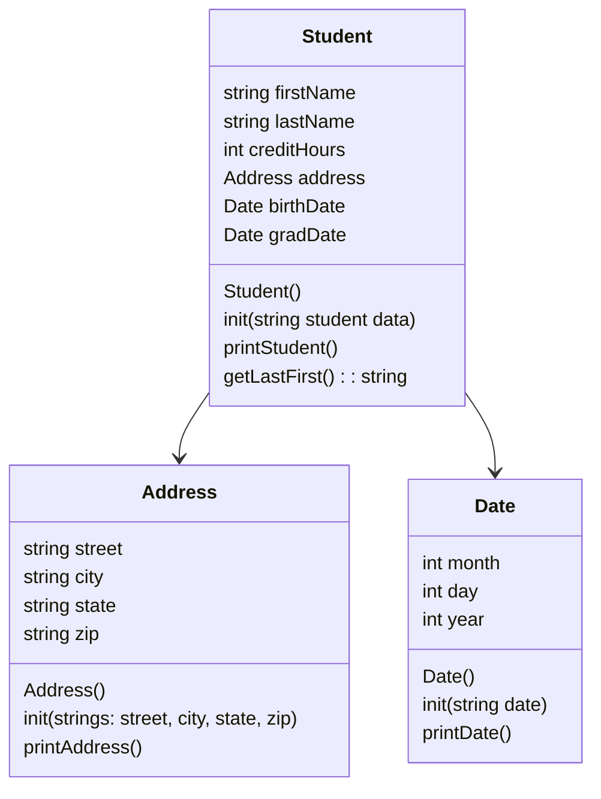

# project7
Heap of Students

## UML Diagram


## Algorithm
### Date
-init(addressDate)
```
string month, day, year
stringstream converter
converter addressDate
getLine (converter, month string, '/')
getLine (~, day string, ~)
getLine(~, year string)
converter << month string, day string, year string
converter >> month, day, year
```
-printDate()
```
print month day, year
```
### Student
```

```
### Address
-init(addressString)
```
string street, city, state, zip
stringstream convderter
getLine (addressString, street string, ',')
getLine (~, city string, ~)
getLine(~, state string, ~)
getLine(~, zip string)
```
-printAddress()
```
print street
print city state, zip
```
